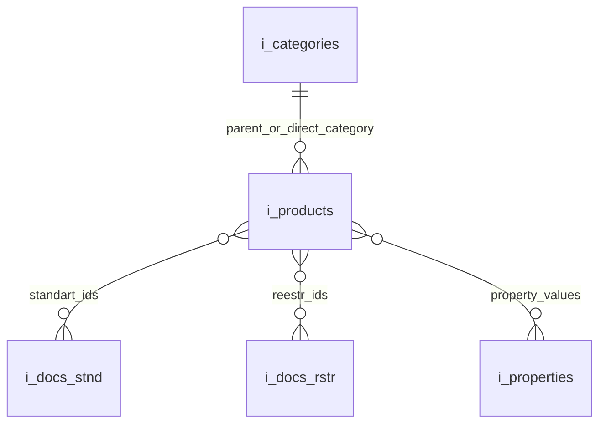

# Plan: Create AI Category Data Endpoint for Mastra Agent

## Objective
Create a dedicated API endpoint (`server/api/ai/categoryData/[c_alias].js`) designed specifically for AI agents to retrieve rich category data, document relationships, and product associations required for generating category specifications and descriptions.

## Final Output Structure

```json
{
  "catData": {
    "name": "Штангенциркули",
    "alias": "shtangentsirkuli",
    "description": "<p>Existing HTML description...</p>",
    "characteristics": "Existing characteristics or empty"
  },
  "docs": {
    "stnd": [
      {
        "number": "ГОСТ 166-89",
        "name": "Штангенциркули. Технические условия.",
        "file": "gost 166-89 [chelinstrument.ru].pdf",
        "products": [
          "Штангенциркуль ШЦ-I-125-0,1 ЧИЗ",
          "Штангенциркуль ШЦ-I-125-0,05 ЧИЗ"
        ]
      }
    ],
    "rstr": [
      {
        "number": "260-05",
        "name": "Штангенциркули",
        "type_si": "ШЦ-I",
        "brand": "АО Ставропольский инструментальный завод (СтИЗ)",
        "date": "2026-07-17T00:00:00.000Z",
        "file_ot": "ot_260-05 [chelinstrument.ru].pdf",
        "file_mp": "mp_260-05 [chelinstrument.ru].pdf",
        "products": [
          "Штангенциркуль ШЦ-I-125-0,1 ЧИЗ",
          "Штангенциркуль ШЦ-I-125-0,05 ЧИЗ"
        ]
      }
    ]
  },
  "categorySummary": {
    "totalProducts": 42,
    "availableProps": {
      "brands": ["ЧИЗ", "СТИЗ", "GRIFF"],
      "types": ["ШЦ-I", "ШЦ-II", "ШЦ-III", "ШЦК", "ШЦЦ"],
      "ranges": ["0-125 мм", "0-150 мм", "0-200 мм", "0-300 мм"],
      "accuracies": ["0.01 мм", "0.02 мм", "0.05 мм", "0.1 мм"]
    }
  }
}
```

## Database Schema & Table Usage Architecture



### Table Details & Usage in Endpoint

1. **`i_categories`**
   - **Purpose**: Category lookup by `alias` and parent/subcategory resolution.
   - **Key Fields**: 
     - `id` (smallint, PK)
     - `parent_id` (smallint): Determines if category is root (0) or subcategory.
     - `name`, `alias`, `description`, `characteristics`
     - `p0_brand`..`p8_pack` (varchar): Comma-separated property filter lists used when querying subcategories.
   - **Query Pattern**: `SELECT * FROM i_categories WHERE alias = ? AND published = 1 LIMIT 1`

2. **`i_products`**
   - **Purpose**: Retrieve published products belonging to the target category/subcategory.
   - **Key Fields**:
     - `id` (mediumint, PK)
     - `category_id` (smallint, FK to parent root category)
     - `name` (varchar): Used for document-to-product mapping strings.
     - `published` (tinyint): Must equal `1`.
     - `standart_ids` (varchar): Comma-separated list of standard IDs (linking to `i_docs_stnd`).
     - `reestr_ids` (varchar): Comma-separated list of registry IDs (linking to `i_docs_rstr`).
     - `p0_brand`..`p8_pack` (smallint): Property value IDs linked to `i_properties`.
   - **Query Pattern**: 
     ```sql
     SELECT id, name, category_id, standart_ids, reestr_ids,
            p0_brand, p1_type, p2_counting_system, p3_range, p4_size, p5_accuracy, p6_class, p7_feature, p8_pack
     FROM i_products 
     WHERE category_id = ? AND published = 1 [AND property_filters...]
     ```

3. **`i_docs_stnd`**
   - **Purpose**: Standards and GOST documents referenced by products.
   - **Key Fields**:
     - `id` (smallint, PK)
     - `number` (varchar): e.g., `ГОСТ 166-89`
     - `name` (varchar): Standard description
     - `file` (varchar): PDF filename
   - **Query Pattern**: `SELECT id, number, name, file FROM i_docs_stnd WHERE id IN (...)`

4. **`i_docs_rstr`**
   - **Purpose**: State Register (ГРСИ) certificates referenced by products.
   - **Key Fields**:
     - `id` (smallint, PK)
     - `number`, `name`, `type_si`, `brand`, `date`
     - `file_ot`, `file_mp` (Included: Описание типа, Методика поверки)
     - `file_svid` (**Excluded** per architectural decision)
   - **Query Pattern**: `SELECT id, number, name, type_si, brand, date, file_ot, file_mp FROM i_docs_rstr WHERE id IN (...)`

5. **`i_properties`**
   - **Purpose**: Resolve property IDs from product property columns into human-readable labels for `categorySummary`.
   - **Key Fields**:
     - `id` (smallint, PK)
     - `group_id` (tinyint)
     - `name` (varchar)
     - `ordering` (smallint)
   - **Query Pattern**: `SELECT id, name, ordering FROM i_properties WHERE id IN (...)`

## Key Architectural Decisions
1. **Endpoint Route**: `server/api/ai/categoryData/[c_alias].js`
2. **Document-First Linking**: Documents (`docs.stnd` and `docs.rstr`) are extracted directly from the category's filtered products (`standart_ids` and `reestr_ids`).
3. **Excluded Documents**: `file_svid` is excluded from registry records (`rstr`), returning only `file_ot` (Описание типа) and `file_mp` (Методика поверки).
4. **Simple String Product Names**: Inside each document object, products are represented as simple string names (`products: ["Штангенциркуль..."]`) containing key markings.
5. **Subcategory Filtering**: Subcategory requests apply active property filters (`catActiveProps`) from `i_categories` (`p0_`..`p8_`), ensuring product and document sets accurately match the subcategory context.
6. **Clean Summary**: `categorySummary` contains `totalProducts` count and human-readable lists of unique property values (`availableProps`).

## Actionable Todo List
- [ ] Create endpoint file `server/api/ai/categoryData/[c_alias].js`
- [ ] Implement category lookup by `alias` (`i_categories`) and validate presence
- [ ] Implement root parent category resolution and subcategory property filtering (`catActiveProps`)
- [ ] Fetch published products belonging to the target category/subcategory context
- [ ] Extract unique `standart_ids` and `reestr_ids` from products
- [ ] Fetch standards from `i_docs_stnd` and State Register documents from `i_docs_rstr` (excluding `file_svid`)
- [ ] Build mapping linking each document to its associated product string names (`products: string[]`)
- [ ] Resolve property IDs via `usePrpsGroupsMap` and `i_properties` to construct `categorySummary.availableProps`
- [ ] Assemble final JSON payload (`catData`, `docs`, `categorySummary`) and test endpoint
